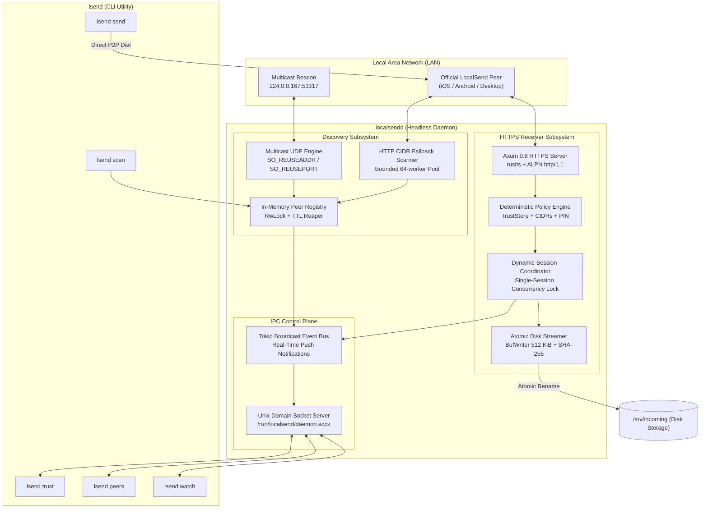

# localsend-daemon (`localsendd` + `lsend`)

[](https://github.com/x7ssss/localsend-daemon/actions/workflows/ci.yml)
[](https://github.com/x7ssss/localsend-daemon/actions/workflows/release.yml)
[](Cargo.toml)
[](Cargo.toml)

A production-grade, headless **LocalSend v2 protocol** daemon and scriptable CLI written in modern Rust with Tokio, Rustls, and Axum. Delivers high-throughput, memory-bounded local file transfers with zero GUI or Flutter dependencies.

---

## Pitch & Motivation

[LocalSend](https://github.com/localsend/localsend) is the premier open-source cross-platform local transfer utility. However, headless server environments, homelabs, TrueNAS/Unraid/Synology NAS nodes, and remote developer machines historically lacked a dedicated CLI daemon (tracked in [LocalSend Issue #11](https://github.com/localsend/localsend/issues/11)). The official Flutter application requires an active display server (X11/Wayland/Quartz) and heavy desktop runtimes unsuitable for servers.

`localsend-daemon` solves this by decoupling the core protocol engine into a lightweight, headless systems architecture:

- **Ultra-Low Memory Footprint**: Operates within `< 15 MiB` resident memory (RSS) even under heavy sustained multi-gigabyte transfers.
- **Zero C / OpenSSL Dependencies**: Pure-Rust cryptographic and networking stack (`ring`, `rcgen`, `rustls`, `tokio`).
- **Static Musl Releases**: Self-contained, statically linked binaries requiring zero system dynamic libraries.
- **Full Protocol Compatibility**: Fully interoperable with all official LocalSend v2.0 and v2.1 clients (Android, iOS, macOS, Windows, Linux).

---

## Architecture Diagram



---

## Feature Matrix

| Feature | `localsend-daemon` Specification |
|---|---|
| **Protocol Compatibility** | Full LocalSend v2.0 & v2.1 wire compatibility (`/api/localsend/v2/*`) |
| **Transport Encryption** | RSA-2048 X.509 v3 self-signed TLS via `rustls` (`ring` provider), strict ALPN `b"http/1.1"` |
| **Trust & Pinning** | Constant-time uppercase 64-hex SHA-256 fingerprint matching & pinning; constant-time PIN authentication |
| **Discovery Subsystems** | Dual-path: Multicast UDP (`224.0.0.167:53317` & `ff12::fd3a:e420`) + concurrent CIDR `/24` HTTP scanner |
| **Streaming IO Engine** | Chunked async body streaming directly to disk with bounded memory (`BufWriter` 512 KiB buffer) |
| **Atomic Commits** | Staging `.localsend_<session>_<file>.part` files with RAII cleanup; atomic rename (`fs::rename`) |
| **Integrity Verification** | Real-time streaming SHA-256 digest computation; rejects mismatches with HTTP 422 |
| **Path Traversal Defense** | Strict sanitization rejecting `..`, `/`, `\`, null bytes, Windows DOS device names, and reserving 255-byte limits |
| **Concurrency Guard** | Single-session mutual exclusion lock rejecting concurrent transfer attempts with HTTP 409 Conflict |
| **Control Plane** | Newline-delimited JSON over Unix Domain Socket (`/run/localsend/daemon.sock`) with push event pub/sub |
| **Packaging & CI** | Production systemd unit, static `musl` binaries, cross-platform GitHub Actions matrix |

---

## Quick Start

### 1. Installation

#### One-Line Shell Installer (Linux & macOS)
```bash
curl -fsSL https://raw.githubusercontent.com/x7ssss/localsend-daemon/main/install.sh | sh
```
This automatically detects your OS and architecture, downloads the latest binary release, installs `localsendd` and `lsend` to `/usr/local/bin`, and optionally installs the `localsendd.service` systemd unit on Linux hosts.

#### Debian / Ubuntu (`.deb`)
Download the `.deb` release package from [Releases](https://github.com/x7ssss/localsend-daemon/releases):
```bash
sudo dpkg -i localsend-daemon_*.deb
```

#### Build from Source
```bash
# Build optimized release binaries
cargo build --release

# Binaries available at:
# target/release/localsendd (Daemon)
# target/release/lsend      (CLI tool)
sudo install -m 755 target/release/localsendd /usr/local/bin/
sudo install -m 755 target/release/lsend /usr/local/bin/
```

### 2. Running the Daemon

Launch the headless daemon specifying a destination directory and trust policy:

```bash
# Accept transfers from trusted peers and subnets automatically
localsendd --save-dir /srv/incoming --auto-accept trusted-only

# Or run in full auto-accept mode (ideal for private homelab networks):
localsendd --save-dir /srv/incoming --auto-accept always --port 53317

# Protect incoming transfers with an optional PIN:
localsendd --save-dir /srv/incoming --pin 482910
```

### 3. Discovering Peers on the Network

Scan for available LocalSend peers advertising on the local network:

```bash
# Passive multicast discovery (listens for 3 seconds)
lsend scan

# Active subnet sweep (probes every host on local /24 subnets)
lsend scan --http-scan --duration 5

# Output in JSON format for automated shell scripts
lsend --json scan
```

### 4. Sending Files via CLI

Send single or multiple files directly to a discovered alias, hostname, or IP address:

```bash
# Send archive to an IP address with progress bar visualization
lsend send 192.168.1.105 ./archive.tar.gz

# Send multiple files with pinned fingerprint verification
lsend send 192.168.1.105 ./video.mp4 ./subtitles.srt \
  --fingerprint 3C8F9A2B4E1D0C6B...

# Send in standalone mode (direct P2P transfer without running daemon):
lsend send 192.168.1.105 ./document.pdf --standalone
```

### 5. Real-Time Daemon Monitoring

Stream transfer progress, peer discovery, and session events in real time:

```bash
# Live event observer (connects to daemon over Unix Domain Socket)
lsend watch
```

Output:
```text
[13:45:01] PEER DISCOVERED: Pixel 8 Pro (192.168.1.142:53317) [mobile]
[13:45:12] SESSION INCOMING: session=a9f1b2c4 peer="MacBook Pro" files=2 size=142.5 MB
[13:45:13] SESSION ACCEPTED: session=a9f1b2c4
[13:45:15] TRANSFER COMPLETED: session=a9f1b2c4 file=backup.tar.gz status=SUCCESS
```

### 6. Managing Trust & Approvals

```bash
# Query daemon status and active jobs
lsend status

# List currently cached peers
lsend peers

# Add a trusted peer fingerprint to the persistent trust store
lsend trust add 9F8E7D6C5B4A3210... --alias "Work Laptop"

# Interactively accept or reject pending transfer sessions
lsend accept <SESSION_ID>
lsend reject <SESSION_ID>
```

---

## Systemd Service Setup

A hardened systemd unit file is provided in `packaging/systemd/localsendd.service`.

### 1. Create Dedicated Service User

```bash
sudo useradd -r -s /usr/sbin/nologin -d /var/lib/localsend localsend
sudo mkdir -p /var/lib/localsend /srv/incoming /run/localsend
sudo chown -R localsend:localsend /var/lib/localsend /srv/incoming /run/localsend
```

### 2. Install Service and Socket

```bash
sudo cp packaging/systemd/localsendd.service /etc/systemd/system/
sudo cp packaging/systemd/localsend.socket /etc/systemd/system/
sudo systemctl daemon-reload
```

### 3. Hardened Security Profile

The unit file enforces strict Linux security sandboxing:

```ini
[Service]
Type=simple
ExecStart=/usr/local/bin/localsendd --save-dir /srv/incoming --auto-accept trusted-only
Restart=on-failure
RestartSec=5s

# Process Identity
DynamicUser=false
User=localsend
Group=localsend

# Sandboxing & Filesystem Isolation
ProtectSystem=strict
ProtectHome=read-only
PrivateTmp=yes
ReadWritePaths=/var/lib/localsend /srv/incoming /run/localsend

# Kernel & Privilege Hardening
AmbientCapabilities=CAP_NET_BIND_SERVICE
CapabilityBoundingSet=CAP_NET_BIND_SERVICE
NoNewPrivileges=true
ProtectKernelTunables=true
ProtectKernelModules=true
ProtectControlGroups=true
MemoryDenyWriteExecute=true
RestrictRealtime=true
RestrictSUIDSGID=true
RestrictAddressFamilies=AF_UNIX AF_INET AF_INET6
```

### 4. Enable and Start

```bash
sudo systemctl enable --now localsendd.service

# Check daemon status and journal logs
sudo systemctl status localsendd
sudo journalctl -u localsendd -f
```

---

## Verification & Testing

The workspace includes extensive unit tests, mock network verification, and an end-to-end loopback integration harness (`tests/e2e_transfer.rs`):

```bash
# Check code formatting across all crates
cargo fmt --all -- --check

# Run zero-warning clippy analysis
cargo clippy --workspace -- -D warnings

# Execute full test suite across workspace
cargo test --workspace

# Run loopback integration tests specifically
cargo test --test e2e_transfer
```

---

## License

Licensed under either of:
- Apache License, Version 2.0 ([LICENSE-APACHE](http://www.apache.org/licenses/LICENSE-2.0))
- MIT License ([LICENSE-MIT](http://opensource.org/licenses/MIT))

at your option.
